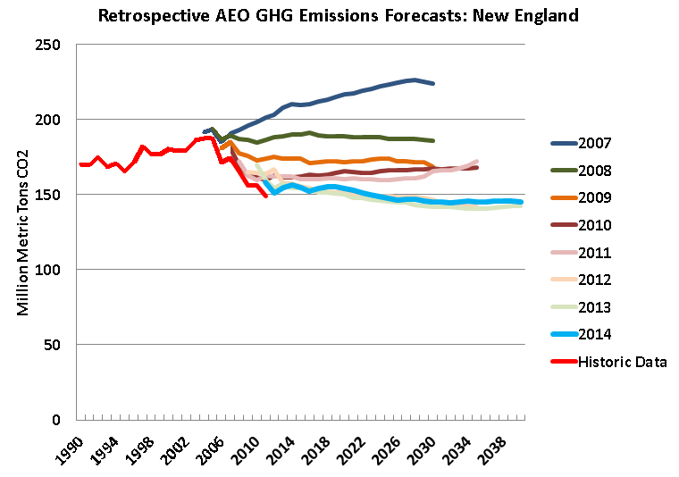
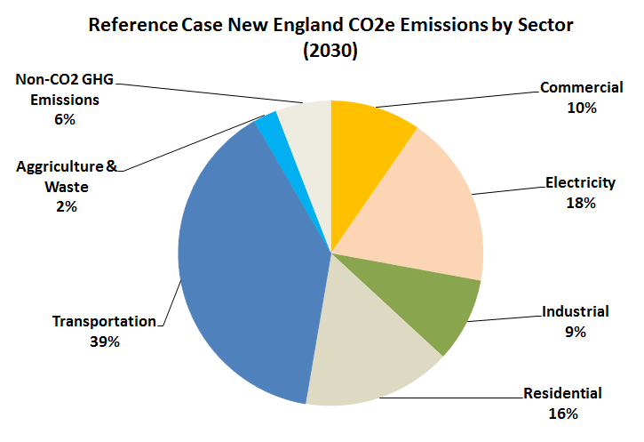

## Background 

> 1. 2008 NEG-ECP efforts

> 2. Updated Reference Case 

> 3. Moving Forward with Updated Wedges Analysis

--- 

## Slide 1

> * P1
> * P2
> * P3

--- &twoCol1 

## How has the AEO Done

*** =left

</img>

*** =right

> * P1
> * P2
> * P3

--- &twoCol1 

## CO2e Emissions by Sector 2030

*** =left

</img>

*** =right

> * P1
> * P2
> * P3

--- &twoCol2 

## Two Column Layout

This slide has two columns

*** =left

- point 1
- point 2
- point 3

*** =right

- point 1
- point 2
- point 3

--- 

